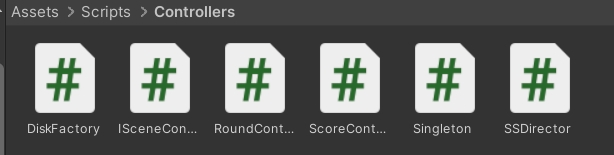

## lab08 Hit UFO

按照课堂要求，采用Unity实现了“打飞碟”游戏。

> 游戏共有5个回合，每回合随机产生不超过10个飞碟按任意方向飞过屏幕。玩家需要在有限的时间内尽可能点击更多的飞碟，获得更高积分。不同颜色的飞碟对应不同积分。

演示视频：https://www.bilibili.com/video/BV1fJCfYjEx3

博客：[https://blog.csdn.net/weixin_43867940/article/details/109420607](https://blog.csdn.net/Nuboj_Cloud/article/details/143637279)

<video src="https://www.bilibili.com/video/BV1fJCfYjEx3"></video>

### 一 · 场景实现

使用自制预制与商店资源构建了游戏场景。

飞碟对象包含刚体属性，以赋予其物理运动特性。

### 二 · 代码架构 

有如下代码结构：

#### (1) Controllers

- 采用工厂模式管理对象，定义`DiskFactory`类负责生产飞碟，`Singleton`类负责实例化工厂。
- 通过定义`ISceneController`等接口负责部件间交互，通过`ScoreController`作为积分类负责计算积分变化。
- 由`RoundControllers`作为主控制器负责控制游戏流程，包括控制资源的加载与回收、结束条件判定等。

#### (2) Actions

在给出的示例代码上进行修改，实现动作管理与游戏场景的分离。

- 定义`SSAction`和`ISSActionCallback`作为动作基类和回调函数接口。在此基础上定义了`PhysicFlyAction`等动作类。
- 定义`SSActionManager`作为动作管理者基类，定义`IActionCallback`和`IActionManager`作为回调函数接口，负责管理对象的运动。在此基础上定义了`PhysicActionManager`负责实现对象的运动。
- 采用Adapter模式，同时兼容`CCcActionManager`与`CCFlyAction`。

#### (3) Views

- 由`UserGUI`类定义用户交互界面。

